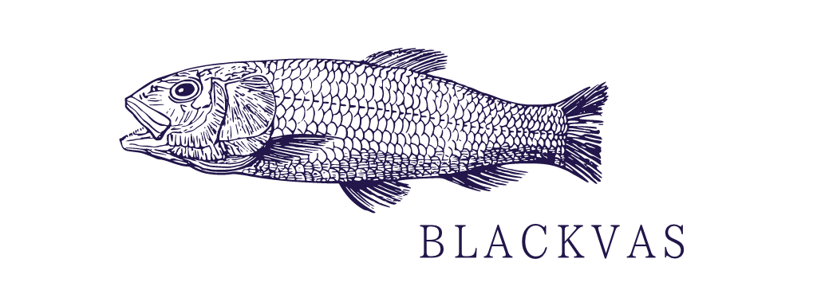

# Blackvas (EN / [Ja](/README_ja.md))
  

**Blackvas** is a declarative UI framework for building Canvas (an HTML5 API).  
It eliminates **redundancy** and **procedural instructions** from traditional JavaScript-based Canvas implementations, while providing useful procedures for events and animations.  
Styling is implemented with reference to CSS properties, allowing you to call primary colors, Japanese colors, and more without using color code.  
It is designed to require as little knowledge of the JavaScript DOM as possible to reduce the learning cost.  
Using the included **Blackvas CLI**, you don't need to know anything specific to Nimble** to start a project.  

## Shape.
A **Shape** is a way to combine shapes, text and other objects into a single form.  

```nim
shapes:
  shape MyShape:
    rect(100, 100, 40, 40)
```

A shape statement **must be used in a shape statement** because **shapes** does the work for shapes defined in the shape**.  
**MyShape** is treated as the name of this shape.  
The shape statement is just a statement that defines a shape and **can't be reflected in a web page**.

## View.
**View** is a way to reflect your shapes on your HTML pages.  

```nim
view:
  MyShape()
````

After defining the shape statement, you can call it as a procedure to reflect it on the page.  

## Style.
**Style** is a mechanism for defining a style element.

```nim
style:
  id myId:
    color = Primary.red
```

**Id** is assigned for each shape to be drawn on the view.  

```nim
view:
  MyShape:
    id = "myId"
```

The id can be given when applying a shape in the view.

## Data.
**Data** is a mechanism for defining variables, but it does not currently implement any special features such as scopes, and will be exposed globally.

## Methods.
**Methods** is a mechanism for defining procedures.  
Here, we show that the id is changed by a click event.  

```nim
methods:
  proc changeId(): (string, string) =
    if rand(1) >= 0.5:
      result = ("id", "id1")
    else:
      result = ("id", "id2")

view:
  MyShape:
    @click = changeId
```
